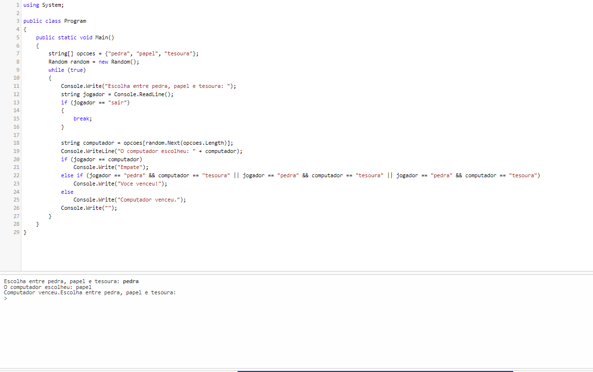

# MeuPrimeiroProjeto

Jogo: Pedra, Papel, Tesoura

##O que é?
***"Pedra, Papel, Tesoura" é um jogo simples onde dois jogadores escolhem entre três opções: pedra, papel ou tesoura.*** 
**As regras são:**

Pedra ganha de tesoura (quebra a tesoura),
Tesoura ganha de papel (corta o papel),
Papel ganha de pedra (cobre a pedra).***

##Como funciona?

***O jogador escolhe entre as opções "pedra", "papel" ou "tesoura".
O computador faz uma escolha aleatória entre as mesmas opções.
O resultado é comparado:
Se as escolhas forem iguais, ocorre um empate.
Se a escolha do jogador vencer a do computador, o jogador ganha.
Caso contrário, o computador vence.
O jogo continua até que o jogador digite "sair".***

##Como construir o jogo?

***Crie uma estrutura de repetição (loop while) que permita ao jogador fazer várias jogadas.
Use um array para armazenar as opções: string[] opcoes = {"pedra", "papel", "tesoura"};.
Gere uma escolha aleatória para o computador utilizando a classe Random.
Compare a escolha do jogador com a do computador e exiba o resultado.
Adicione uma condição para encerrar o jogo se o jogador digitar "sair".***

Comandos Básicos para Configuração e Uso do Git:

Inicializar um repositório Git
Para começar a usar o Git em um projeto:

## git init
Adicionar arquivos ao repositório
Adicione os arquivos ao controle de versão:

## git add .
Fazer um commit
Salve as mudanças com uma mensagem descritiva:

## git commit -m "Mensagem do commit"
Conectar ao repositório remoto (GitHub, GitLab, etc.)
Se ainda não houver um repositório remoto, crie um e conecte-o:

## git remote add origin https://github.com/usuario/repositorio.git
Enviar as mudanças para o repositório remoto
Para subir o código:

## git push -u origin master
Verificar o status dos arquivos
Veja quais arquivos foram modificados ou adicionados:

## git status
Esses são os comandos básicos para configurar e utilizar o Git .
